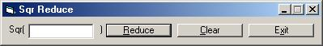



## Sqr Reduce

### Description

This program reduces numbers under radicals. If you wanted to reduce the square root of 75, just type 75 into the text box and press enter. A message box will come up and tell you that the square root of 75 reduced is 5*Sqr(3). Code is not commented, but easy to under stand. E-mail me if you have any questions. Vote if you like.
 
### More Info
 

             |
---                |---
**Submitted On**   |2001-06-02 18:17:12
**By**             |[Jason Woods](https://github.com/Planet-Source-Code/PSCIndex/blob/master/ByAuthor/jason-woods.md)
**Level**          |Beginner
**User Rating**    |5.0 (10 globes from 2 users)
**Compatibility**  |VB 5\.0, VB 6\.0
**Category**       |[Math/ Dates](https://github.com/Planet-Source-Code/PSCIndex/blob/master/ByCategory/math-dates__1-37.md)
**World**          |[Visual Basic](https://github.com/Planet-Source-Code/PSCIndex/blob/master/ByWorld/visual-basic.md)
**Archive File**   |[Sqr Reduce20446622001\.zip](https://github.com/Planet-Source-Code/jason-woods-sqr-reduce__1-23708/archive/master.zip)

